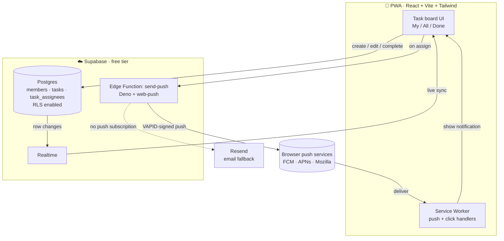

# 🏠 Family Task Board

**A real-time, installable task manager that replaced my family's lost-in-the-group-chat to-do list.**


A shared board for a family of four to assign each other tasks, see them **sync live across every device**, and get **push notifications** — installed straight to the home screen as a Progressive Web App, no app store required. Built and shipped end-to-end on a strict **$0 budget** (all free tiers), and currently in real daily use by my family.

> **Why I built it:** chores and reminders kept getting buried in our group messages. I wanted one shared source of truth that worked on everyone's phone *and* could actually ping you when something's assigned or due — without paying for anything or forcing my family through a login flow.

---

## 🔗 Live demo & screenshots

> **Live demo:** _a public, multi-tenant demo (create your own family with a join code) is in progress — link coming here._
> The private family instance is intentionally not linked publicly (it's a trust-based, no-login app — see [Security model](#-security--privacy-notes)).

<!--
  SCREENSHOTS — add 2–3 PNGs to docs/screenshots/ with these names, or drag images
  directly into this section using GitHub's web editor (it uploads + links them for you):
-->
| Pick your name | My Tasks | Create a task |
|:--:|:--:|:--:|
|  |  |  |

---

## ✨ Features

- **No-friction identity** — pick your name from four colorful buttons; saved in `localStorage`. No passwords, no email auth (by design — it's a trusted family app).
- **My / All / Done tabs** — *My Tasks* sorted by due date with **overdue highlighted in red**; *All Tasks* groupable by person or by due date; *Done* as a never-deleted archive.
- **Full task lifecycle** — create/edit with title, description, due date, and **multi-assignee** selection; open any task to see who assigned it, when, and who completed it; mark complete / reopen.
- **Real-time sync** — powered by Supabase Realtime: a change on one phone appears on every other device instantly, no refresh.
- **Push notifications** — assign someone a task and their device gets a Web Push notification (VAPID-signed), delivered through a Supabase Edge Function. **Verified working end-to-end** on desktop; iOS supported via Add-to-Home-Screen (iOS 16.4+).
- **Email fallback** — if a member hasn't enabled push, the same Edge Function falls back to email via Resend.
- **Installable PWA** — manifest + service worker; "Add to Home Screen" on mobile and desktop.
- **Colorful, mobile-first UI** — each member has a signature color across their avatar, tasks, and name chips.

---

## 🏗️ Architecture



**The end-to-end flow:** the React PWA reads/writes tasks in Postgres; Supabase Realtime streams every change back to all devices; on assignment the client calls the `send-push` Edge Function, which signs a Web Push message with VAPID keys and delivers it to each assignee's device — falling back to email when no push subscription exists.

---

## 🧰 Tech stack

| Layer | Choice |
|---|---|
| Frontend | React 18, Vite 5, Tailwind CSS 4 |
| Backend | Supabase — Postgres, Realtime, Edge Functions (Deno) |
| Notifications | Web Push API (VAPID) + Resend email fallback |
| PWA | Web App Manifest + Service Worker |
| Hosting | Vercel (frontend) + Supabase (data/functions) — all free tier |

---

## 🚀 Run it locally

```bash
# 1. Install
npm install

# 2. Configure — copy the template and fill in your Supabase keys
cp .env.example .env

# 3. Run
npm run dev          # http://localhost:5173
```

**Database setup** (one time): create a free Supabase project, then run `supabase/migrations/0001_init.sql` followed by `supabase/seed.sql` in the SQL editor. Full walkthrough in [`supabase/README.md`](supabase/README.md). Until `.env` is filled in, the app shows a setup notice instead of crashing.

---

## 📁 Project structure

```
src/
  components/   NamePicker, TaskCard, TaskForm, TaskDetail, Modal, Avatar, MemberChip
  lib/          supabase client · useBoard (data + realtime + mutations)
                useCurrentMember · push (subscribe/send) · colors · dates
public/         manifest.webmanifest · sw.js · PWA icons
supabase/
  migrations/   0001_init.sql  — schema, RLS policies, Realtime
  functions/    send-push/     — Web Push + email-fallback Edge Function
  seed.sql      sample members + tasks
```

---

## 🔒 Security & privacy notes

This is deliberately a **no-login, trust-based app** for a single household, so it uses permissive (allow-all) Row Level Security under Supabase's anon key. That's appropriate for a private family board but means it's **not multi-tenant** — which is exactly why the family instance isn't linked publicly. All real secrets (VAPID private key, service-role key, Resend key) live only in environment variables / Supabase secrets and are **never committed** (`.env` is gitignored; see [`.env.example`](.env.example) for the full list).

---

## 🗺️ Roadmap

- [x] Core app: name picker → live task board → create/edit/complete → Done archive
- [x] PWA: manifest, service worker, installable
- [x] Web Push notifications (VAPID) via Supabase Edge Function — verified end-to-end
- [ ] Daily cron: "due tomorrow" + "overdue" reminders
- [ ] Resend email fallback wired into production
- [ ] **Multi-tenant demo** — create/join a family by code, so anyone can try it live
```
